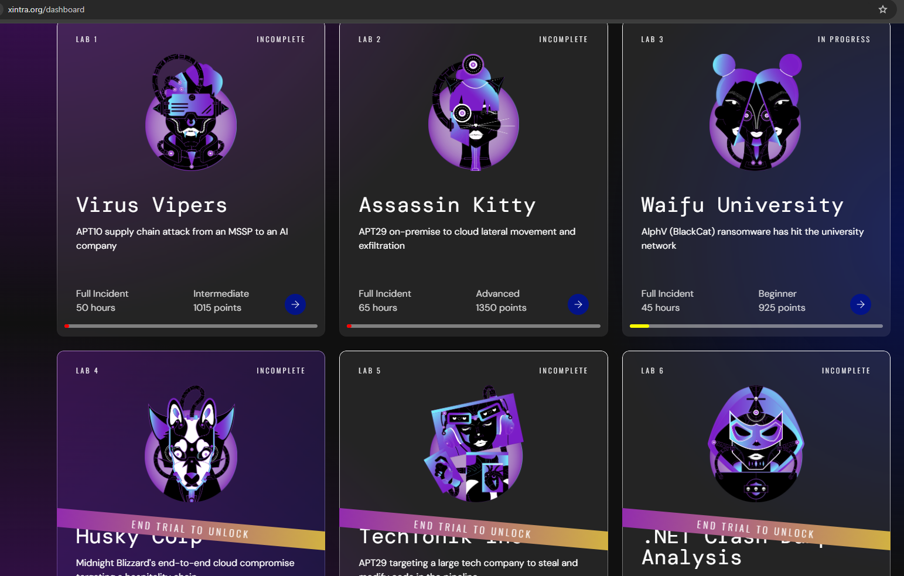
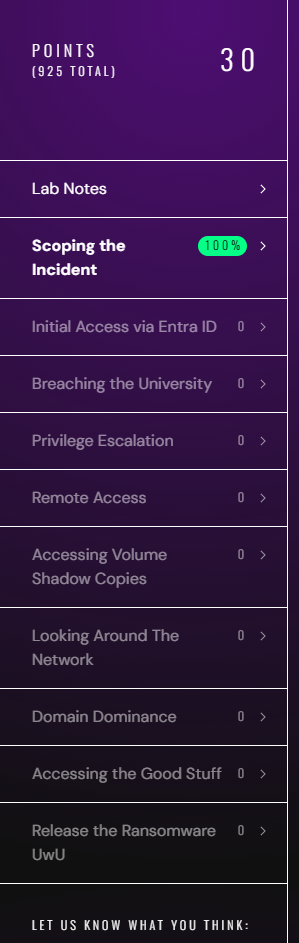
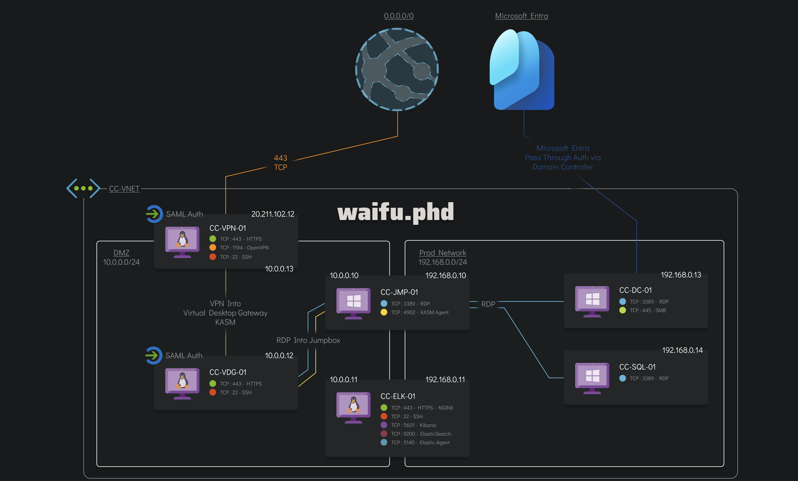
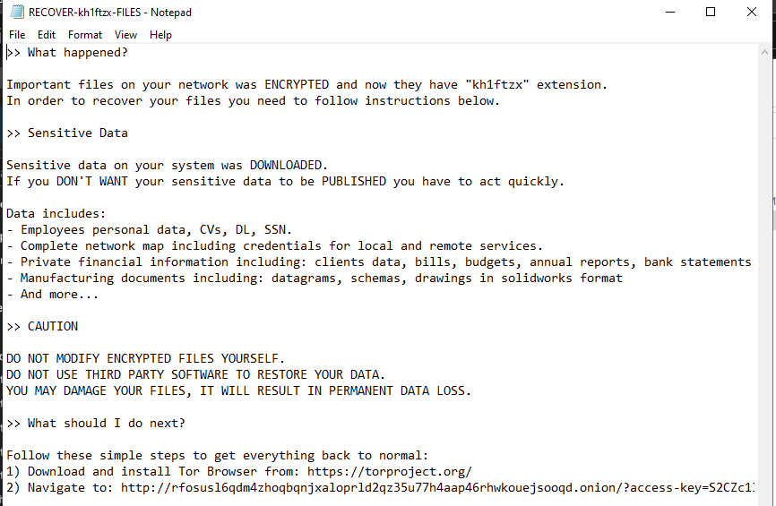
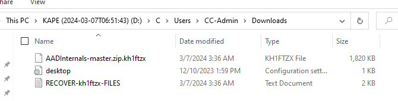
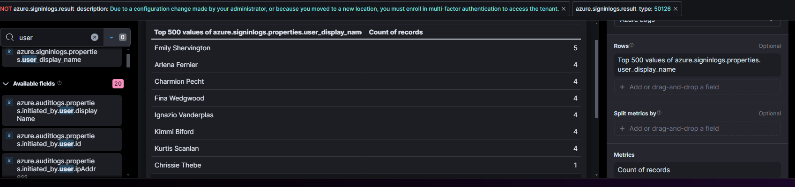
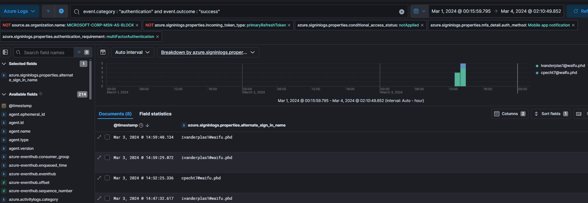
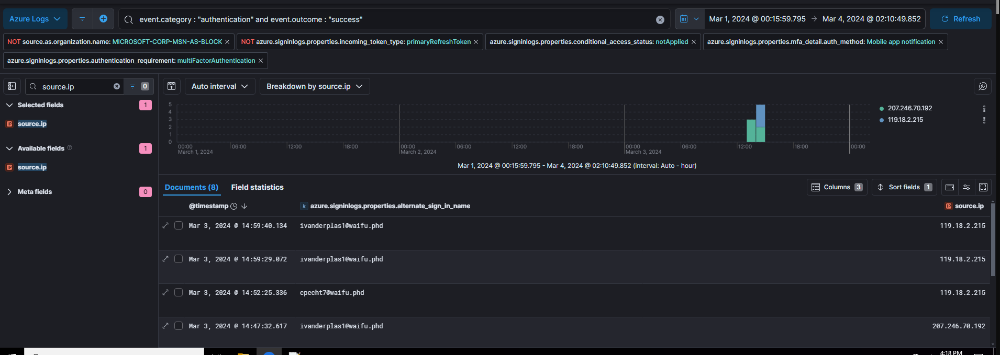

# Xintra APT Emulation Lab - Waifu University

https://www.xintra.org/dashboard

Recently I discovered Xintra labs (I believe it was some black friday discount code) and now I finally have a bit of time to try their lab environment.

They have a number of APT labs by now and seem to release new labs regularly.

During the trial period, three labs are accessible, one of each difficulty.

For starting out, I will try this "beginner" lab.

For this lab, the user gets a Windows VM that contains data related to the investigation and access to an ELK stack with logs.

The lab is split into a number of subsections for the different topics.

## Lab Notes
### LAB DESCRIPTION
This is an emulation of Alphv/BlackCat ransomware group. This lab is designed to test your incident response and detection capabilities when faced with a ransomware breach with techniques including (but not limited to):

* VPN compromise
* BlackCat ransomware deployment
* Cloud credential compromise
* Local administrator privilege escalation
* C2 deployment

You are provided a Windows 11 VM prepped with all the tools, snapshots and evidence you will need to answer these questions. You are also granted access to an ELK instance with pre-parsed logs to conduct the analysis. Take a read of the scoping note to begin the investigation.

We have also provided for your convenience:

* Pre-parsed KAPE output

### SCOPING NOTE
(＞ω＜) ♡ Welcome to Waifu University ♡ (＞ω＜)

Waifu University's cyber team has called you after their IT teams reported a number of servers with files that aren't opening and have a strange extension.

On your scoping call, the victim also said they had identified a ransom note stating their data has been stolen. When asked about any earlier signs, the victim mentioned some strange, failed login activity early in March 2024 in their Entra ID, but wasn't of concern at the time...

Ransomware will typically avoid system files to not cause crashes in the system, which also happens to be where a lot of forensic evidence is! You have been provided triage images of the hosts and log exports from the relevant systems.

The Waifu University team took triage collections from the affected hosts using the account WAIFU\kscanlan6 at approximately 2024-03-07 05:00:00 UTC. Consider activity after this point related to the response.

## Timeline

This incident took place in early March 2024.

maybe mitre or kill chain based

### Initial access

### Lateral movement

### Exfilatration

## Scoping the incident

Personally, I had a bit of a harder than expected start here, which is likely lack of experience. In the end, 
I unzipped the existing images, loaded them and took a look around. 

I assume there is a better way to do this with some kind of tool.

### Question 1

> What was the domain the threat actor has requested the victim to visit in order to further communications?

As can be seen in the note, the ransom domain is an onion domain: 
`rfosusl6qdm4zhoqbqnjxaloprld2qz35u77h4aap46rhwkouejsooqd[.]onion`

### Question 2

> What was the file name of the ransom note left behind by the ransomware?

`RECOVER-kh1ftzx-FILES.txt`

### Question 3

> What was the file extension the ransomware added to encrypted files?

`.kh1ftzx`

## Initial Access via Entra ID

### Question 1

> Our security team mentioned that there was a number of failed logons to the victims Identity Provider (Entra ID).
> 
> What was the full user agent string that was responsible for these attempts?

This is not the useragent with the overall most failed logins, instead it is this useragent: 

`Mozilla/5.0 (Windows NT 10.0; Win64; x64) AppleWebKit/537.36 (KHTML, like Gecko) Chrome/104.0.0.0 Safari/537.36`

### Question 2

> What was the cloud provider the threat actor used to proxy their requests? Please use the acronym.
>
> Example: GCP

Two random source.ip(s) for the login events
* 3.15.36.21
* 3.12.219.51

both belong to Amazon, so the answer is AWS.

### Question 3

> How many unique users did the threat actor attempt to authenticate with?

8

### Question 4

> What was the User Principal Name (UPN) of the user the threat actor succeeded in accessing?
>
> Format: egirl@waifu.phd

ivanderplas1@waifu.phd

Maybe add hints somewhere for personal

### Question 5

> What was the most likely method the threat actor was able to authenticate to the VPN that was protected by MFA?
>
> 1. [X] MFA push fatigue
> 2. [ ] Session Hijacking
> 3. [ ] SIM Hacking
> 4. [ ] App Consent

### Question 6

> What was the IP that successfully logged into the environment?

207.246.70.192

### Question 7 

> What was the SSH fingerprint for the IP?
>
> Note: Make sure to look for historical info around the time of the intrusion as IP addresses may frequently change owners.
>
> Format: ab:cd:ef:12:34:56:78:90:ab:cd:ef:12:34:56:78:90

## Breaching the University

### Question 1
> What was the hostname the threat actor was able to first access once in the network (also known as the beachhead host)?

### Question 2
> What was the hostname of the threat actor's device used to get into the network?

### Question 3
> What did the threat actor search for via a Web Browser from the initial beachhead host?

### Question 4
> The initial compromised user created a PowerShell process on the beachhead host. What domain did the process make a DNS query for?
>
> Format: domain.com (do not include subdomains)

### Question 5
> What was the Github repo URL the threat actor downloaded a tool from on the beachhead host?
>
> Format: https://github.com/username/repository

## IOCs

